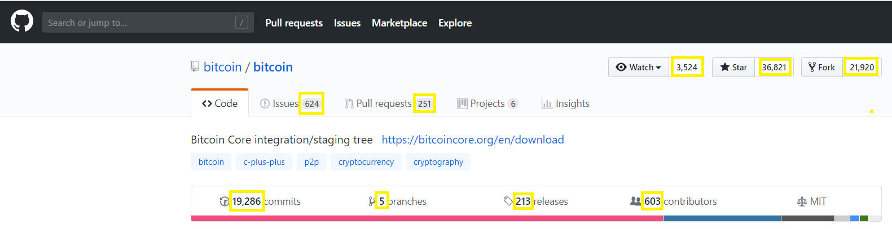

# github-repository-csharp
This library captures a few github repository metrics. The library captures the number of watchers, stars, forks, issues, pull requests, commits, branches, releases, and contributors.
#  

### Table of Contents
**[Available For](#available-for)**<br>
**[Nuget](#nuget)**<br>
**[Usage](#usage)**<br>
**[Contributing](#contributing)**<br>


## Available For
- .NET Standard 2.0
- .NET 4.6.1
- .NET 4.5


## Nuget

 ```
    PM> Install-Package github-repository-csharp
```
[](https://www.nuget.org/packages/github-repository-csharp/)\
[](https://www.nuget.org/packages/github-repository-csharp/)


## Usage


```
using Github;
using System;

namespace ConsoleApp1
{
    public class Program
    {
        public static void Main(string[] args)
        {
            var githubRepoCoordinator = new GithubRepositoryCoordinator("https://github.com/btccom/btcpool");
            var repositoryDetails = githubRepoCoordinator.GetRepositoryDetails();

            Console.WriteLine(repositoryDetails.Watches);
            Console.WriteLine(repositoryDetails.Stars);
            Console.WriteLine(repositoryDetails.Forks);
            Console.WriteLine(repositoryDetails.Issues);
            Console.WriteLine(repositoryDetails.PullRequests);
            Console.WriteLine(repositoryDetails.Commits);
            Console.WriteLine(repositoryDetails.Branches);
            Console.WriteLine(repositoryDetails.Releases);
            Console.WriteLine(repositoryDetails.Contributors);
        }
    }
}
```

## Contributing

Pull requests are welcome. 

For large changes, please open an issue first to discuss what you would like to add.
